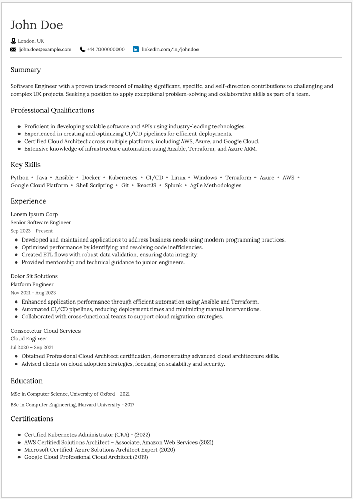
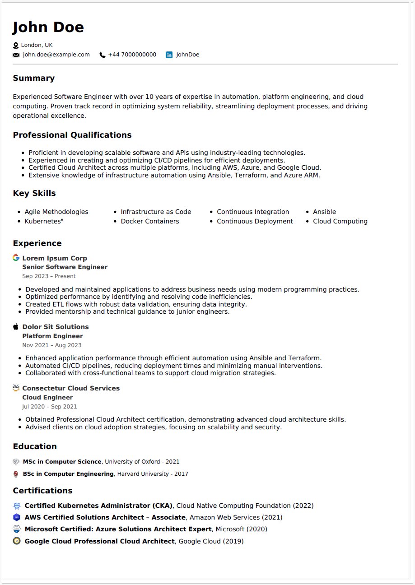

# **Resume/CV Builder**🛠️

**Build Professional Résumés with Ease 🚀** 

## 🌐 Try It Online

You can now use the **Resume/CV Builder** directly on the web! 

1. Download a [sample template](samples/modern/) to get started.
2. Edit the `.yaml` file with your details.
3. Go to: https://easyfreeresume.com/ and Upload your template and generate your resume instantly.

---


## 🎯 Project Goal

This tool is built to simplify the process of creating and updating resumes. The idea is for the users to be able to **Focus on your content, not the formatting.**

**Key Benefits:**

* **Effortless Updates:** 
  Update content in a YAML file to instantly refresh or customize your resume.
* **Modern & Professional Designs:** 
  - Select from a range of sleek, ATS-compliant [templates](#templates) with consistent formatting.
  - Ensure consistent formatting across all versions.
* **ATS-Optimized:** 
  Ensure your resume is fully scannable by Applicant Tracking Systems (ATS), helping you stand out in the job market.
* **Customizable PDFs:** 
  Add icons, hyperlinks, and logos to enhance your resume's visual appeal, while adhering to industry standards.


Checkout the guide to [getting started](#getting-started). 
Here are all the [features](#features) available. 

## Templates

<details>
  <summary>🚀 View Available Templates</summary>

### Modern (No Icons)

A clean, single-column layout with no custom icons.

**YAML Sample:**  
`template_path: samples/modern/john_doe_no_icon.yml`

**Screenshot:**  


---

### Modern (With Icons)

A clean, single-column layout with decorative icons for sections like experience, education and certifications.

**YAML Sample:**  
`template_path: samples/modern/john_doe.yml`

**Screenshot:**  


</details>

<details>
  <summary>View Upcoming Templates</summary>


### Minimalist (Work in Progress)

A streamlined, no-frills layout focused purely on content with minimal design elements.


### Creative (Planned)

A visually striking layout featuring color highlights and unique typography for a bold statement.

**YAML Sample:**  
`template_path: samples/creative_sample.yml`

*(Screenshot and YAML file coming soon)*

</details>


## Features

### Core Features

- **Dynamic Templates**: Choose from multiple styles with distinct layouts and formatting.
- **ATS Compatibility**: Ensures resumes are parsed correctly by Applicant Tracking Systems.
- **Structured Data**: Use YAML to input resume data for flexibility and ease of use.
- **Customizable Icons and Logos**: Add company icons, skill logos, or section-specific icons (optional).
- **Custom fonts**: Supports Google fonts.
- **Multi-column Support**: Dynamic adjustment for skill lists and other sections to optimize space.
- **PDF Generation**: Output resumes in a polished PDF format.


## Supported Section Types

The following section types are supported, each designed to present information in a structured and visually appealing way.

| **Type**         | **Description**                                                                                         | **Example Usage**                |
|-------------------|---------------------------------------------------------------------------------------------------------|----------------------------------|
| `text`           | A simple text block, typically used for sections like "Summary" or single-paragraph content.            | Summary, Objective               |
| `bulleted-list`  | A bulleted list format for sections requiring multiple items listed in bullets.                          | Professional Qualifications      |
| `inline-list`    | A horizontally displayed list, usually without bullets, for a compact, single-line view.                | Key Skills, Personal Interests   |
| `icon-list`      | A list with optional icons next to each item, often used for certifications or awards with specific icons.| Certifications                   |
| `dynamic-column-list` | Dynamically adjusts the number of columns based on the items, ideal for skill sections or compact lists. | Skills                           |
| `experience`     | A structured format for job experience with fields for company, title, dates, and description as bullet points.| Experience                       |
| `education`      | A structured format for academic qualifications with institution, degree, and date.                     | Education                        |


### Generic Section Example

Below is a generic section structure that can be modified to use any of the supported types above:

```yaml
- name: [Section Name]
  type: [Section Type] # Replace with a supported type (e.g., text, bulleted-list, experience, etc.)
  content:
    # Replace with content matching the selected type
    - Example Content 1
    - Example Content 2
    - Example Content 3
```

### Notes:
- Replace `[Section Name]` with the title of your section (e.g., Summary, Skills, Experience).
- Replace `[Section Type]` with one of the supported types listed in the table above (e.g., text, bulleted-list, experience).
- Update `content` to match the data format for the selected type.


## Getting Started

### Quick Start Guide: 

1. **Clone the repository**:

```bash
git clone https://github.com/aafre/resume-builder.git
```

2. **Navigate to the project directory**: 

```bash
cd resume-builder
```

3. **Prepare your input**: 
    - Explore the Resume [Templates](#Templates) section preview available resume styles and choose the one that best suits your needs.
    - Edit the `.yaml` file from the `samples/` folder with your details.
        - **First time use**: Start with the sample template by simply updating the content with your details. Then, proceed to the [execution](#execution) step.
        - **Advanced Use**: Refer to the [Supported Section Types](#supported-section-types) section to customize your resume format with additional or modified sections.
    - If you wish to use icons, please drop them in the `icons/` folder. And in the `YAML` config, just specify the icon file name. No need to specify absoluete or relative paths. This is something that needs to be improved. 


### Execution


#### Option 1: Simplest Approach – Executable (Work in Progress)

- This feature is currently under development.
- Once available, this option will allow you to generate resumes without any setup by running a pre-built executable file.


#### Option 2: Run Using Python

1. **Create a virtual environment and Install dependencies**: 

```bash
pip install -r requirements.txt
```


2. **Generate your resume**:
Run the script using the command below. Replace <template> with the desired template name, <input> with the path to your `.yaml` file, and <output> with the desired output file location.

```bash 
python resume_generator.py --template modern --input data/sample.yml --output output/resume.pdf
```

Flag Details:
- `--template`: Specify the template name (modern, etc.).
- `--input`: Path to the .yaml file containing resume data.
- `--output`: Path to save the generated PDF.


#### Option 2: Run Using Docker

1. **Build the Docker Image**:

```bash 
docker build -t resume-builder .
```

2. **Run the container**: 

```bash 
docker run -it --rm -v "${pwd}:/app/" --entrypoint /bin/bash resume-builder
```

For windows users, replace `${pwd}` with `%cd%`.

3. **Generate Your Resume**:

```bash
python resume_generator.py --template modern --input data/sample.yml --output output/resume.pdf
```


