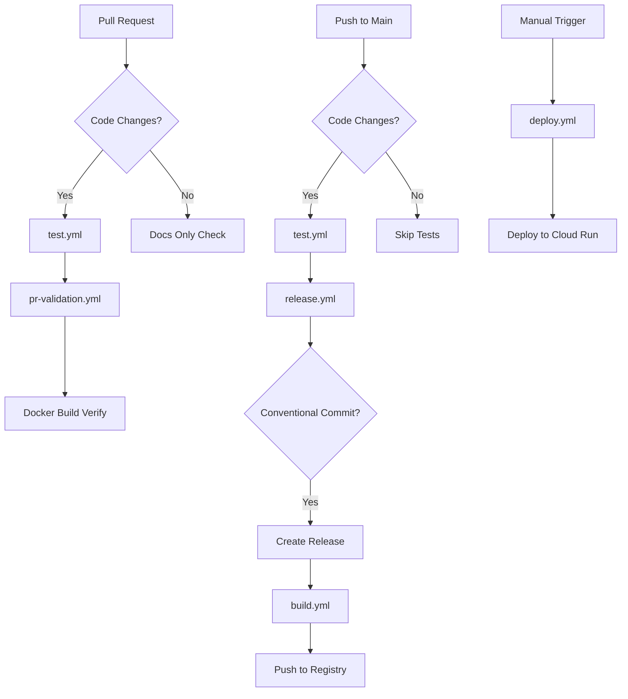

# CI/CD Pipeline Documentation

This document describes the complete CI/CD pipeline for the Resume Builder project, including all workflows, triggers, and deployment processes.

## Overview

The pipeline is designed with separation of concerns, using dedicated workflows for testing, building, and deployment. This provides better visibility, faster feedback, and more reliable deployments.

## Workflow Architecture



## Core Workflows

### 1. `test.yml` - Frontend Tests
**Purpose**: Run frontend unit tests with coverage reporting

**Triggers**:
- Pull requests to `main` (with code changes)
- Pushes to `main` (with code changes)

**Path Filtering**:
- `resume-builder-ui/**` - Frontend code
- `app.py` - Backend API
- `resume_generator*.py` - PDF generation
- `templates/**` - Resume templates
- `requirements.txt` - Python dependencies
- `package*.json` - Node dependencies

**Jobs**:
1. **Frontend Tests**
   - Setup Node.js 20
   - Install dependencies (`npm ci`)
   - Run tests with coverage (`npm run coverage`)
   - Generate test summary

**Badge**: [](https://github.com/aafre/resume-builder/actions/workflows/test.yml)

---

### 2. `build.yml` - Docker Build and Push
**Purpose**: Build Docker image, run security scans, and push to registry

**Triggers**:
- Push to `main` (with code changes)
- Called by other workflows (`workflow_call`)

**Inputs** (when called):
- `version`: Docker image tag (required)

**Jobs**:
1. **Build and Push**
   - Checkout code
   - Setup Docker Buildx
   - Generate image metadata
   - Authenticate with GCP
   - Build Docker image
   - Run Trivy security scan
   - Upload security results to GitHub
   - Tag and push to GCP Artifact Registry

**Registry**: `europe-west2-docker.pkg.dev/uk-vm-00001/resume-builder/easyfreeresume-app`

**Security**: 
- Trivy vulnerability scanning
- Results uploaded to GitHub Security tab
- Builds continue on vulnerabilities (reported only)

**Badge**: [](https://github.com/aafre/resume-builder/actions/workflows/build.yml)

---

### 3. `deploy.yml` - Manual Deployment
**Purpose**: Deploy specific image versions to Cloud Run

**Triggers**:
- Manual trigger only (`workflow_dispatch`)

**Inputs**:
- `image_tag`: Docker image tag to deploy (default: `latest`)
- `environment`: Target environment (`production`, `staging`)

**Jobs**:
1. **Deploy to Cloud Run**
   - Validate inputs
   - Authenticate with GCP
   - Verify image exists in registry
   - Deploy to Cloud Run service
   - Run basic health check
   - Generate deployment summary

**Configuration**:
- **CPU**: 1 vCPU
- **Memory**: 1Gi
- **Scaling**: 0-10 instances
- **Concurrency**: 80 requests per instance
- **Timeout**: 300 seconds
- **Access**: Unauthenticated (public)

---

## Orchestration Workflows

### 4. `pr-validation.yml` - Pull Request Validation
**Purpose**: Validate pull requests before merge

**Triggers**:
- Pull requests to `main`

**Jobs**:
1. **Detect Changes** - Path filtering to determine if tests/builds are needed
2. **Run Tests** - Calls `test.yml` if code changed
3. **Build Docker (Verify)** - Quick Docker build verification (no push)
4. **Documentation Only** - Fast completion for docs-only changes

**Smart Filtering**:
- **Code changes**: Runs full test and build pipeline
- **Documentation only**: Skips tests, completes quickly

---

### 5. `release.yml` - Release and Build
**Purpose**: Create releases and build production images

**Triggers**:
- Push to `main`

**Release Logic**:
- Uses conventional commits to determine if release is needed
- Generates changelog with `git-cliff`
- Creates GitHub release
- Tags the repository

**Jobs**:
1. **Detect Changes** - Path filtering
2. **Run Tests** - Calls `test.yml` if code changed
3. **Create Release** - Conventional commit processing
4. **Build** - Calls `build.yml` with version tag

**Conventional Commit Types**:
- `feat:` - New feature (triggers release)
- `fix:` - Bug fix (triggers release)
- `docs:` - Documentation only (no release)
- `chore:`, `refactor:`, etc. - No release unless breaking

---

## Path-Based Optimization

The pipeline uses intelligent path filtering to skip unnecessary work:

### Code Paths (Run Tests & Build):
```yaml
- 'resume-builder-ui/**'     # Frontend React code
- 'app.py'                   # Flask backend
- 'resume_generator*.py'     # PDF generation scripts
- 'templates/**'             # Resume templates
- 'requirements.txt'         # Python dependencies
- 'package*.json'            # Node.js dependencies
- 'Dockerfile*'              # Container definitions
```

### Documentation Paths (Skip Tests):
```yaml
- '*.md'                     # Markdown files
- 'docs/**'                  # Documentation
- 'LICENSE'                  # License file
- '.gitignore'               # Git ignore
```

## Deployment Process

### Automatic (CI/CD):
1. **Development**: Code changes pushed to branch
2. **Pull Request**: Tests run automatically
3. **Code Review**: Manual review and approval
4. **Merge**: Tests + build + push to registry
5. **Release**: Automatic if conventional commit

### Manual Deployment:
1. **Navigate**: GitHub Actions → Deploy workflow
2. **Run Workflow**: Select image tag and environment
3. **Monitor**: Check deployment status and health
4. **Verify**: Automatic health check included

### Emergency Deployment:
- Use `deploy.yml` with specific image tag
- Can deploy any previously built image
- Independent of CI/CD pipeline

## Security and Authentication

### GCP Authentication:
- Service Account: `easyfreeresume-account@uk-vm-00001.iam.gserviceaccount.com`
- Stored as: `secrets.GCP_SERVICE_ACCOUNT_KEY`
- Permissions: Artifact Registry, Cloud Run, Container Images

### Security Scanning:
- **Tool**: Trivy vulnerability scanner
- **Frequency**: Every build
- **Action**: Report vulnerabilities, continue build
- **Storage**: GitHub Security tab

### Secrets Management:
- `GCP_SERVICE_ACCOUNT_KEY` - Google Cloud authentication
- `GCP_CLOUD_RUN_SERVICE` - Cloud Run service name
- All secrets stored in GitHub repository settings

## Monitoring and Observability

### GitHub Actions:
- **Test Results**: Displayed in PR checks
- **Build Status**: Available via badges
- **Security Scans**: GitHub Security tab
- **Deployment Status**: Workflow summaries

### Cloud Run:
- **Metrics**: CPU, memory, request count
- **Logs**: Application and system logs
- **Health**: Automatic health checks
- **Scaling**: Auto-scaling based on traffic

## Troubleshooting

### Common Issues:

#### Tests Failing:
1. Check test output in workflow logs
2. Run tests locally: `cd resume-builder-ui && npm test`
3. Check for dependency issues

#### Build Failing:
1. Verify Docker syntax
2. Check GCP authentication
3. Ensure registry permissions

#### Deployment Failing:
1. Verify image exists in registry
2. Check Cloud Run service permissions
3. Validate service configuration

#### Path Filtering Not Working:
1. Check file paths match filters exactly
2. Verify workflow triggers
3. Test with simple file changes

### Emergency Procedures:

#### Rollback Deployment:
1. Use `deploy.yml` with previous image tag
2. Check registry for available tags:
   ```bash
   gcloud container images list-tags europe-west2-docker.pkg.dev/uk-vm-00001/resume-builder/easyfreeresume-app
   ```

#### Bypass CI/CD:
1. Manual deployment via GCP Console
2. Use existing registry images
3. Update Cloud Run service directly

## Performance Optimization

### CI/CD Optimizations:
- **Path Filtering**: Skip unnecessary workflows
- **Docker Caching**: Layer caching for faster builds
- **Parallel Execution**: Independent workflow jobs
- **Minimal Dependencies**: Only install what's needed

### Build Optimizations:
- **Multi-stage Builds**: Smaller production images
- **Security Scanning**: Non-blocking vulnerability checks
- **Registry Caching**: Faster subsequent builds

## Workflow Dependencies

```
pr-validation.yml → test.yml
release.yml → test.yml → build.yml
deploy.yml (independent)
```

## Badge Status

The repository displays real-time status via GitHub badges:

- **Tests**: Shows test execution status
- **Build**: Shows build and push status  
- **License**: MIT license information

These badges provide immediate visibility into the health of the CI/CD pipeline.

---

*This documentation is maintained alongside the workflows. For questions or improvements, please open an issue or pull request.*