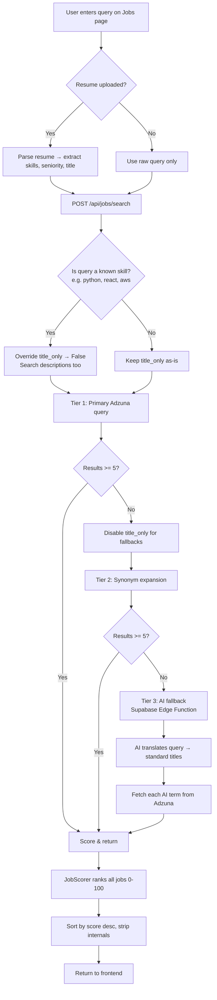

# Job Search Engine — Architecture & Flow

> **Source:** `job_engine.py` (backend engine), `app.py` (API endpoints), `JobsPage.tsx` (frontend)

## Overview

The job search uses a **3-tier progressive broadening** strategy with **backend re-ranking**. Each tier widens the search if the previous tier didn't return enough results. All results are scored against the user's resume context (0–100 points).

## End-to-End Flow



## 3-Tier Search Strategy

### Tier 1 — Primary Query
- Sends the user's query directly to [Adzuna API](https://developer.adzuna.com/)
- If `title_only` is set (and query is NOT a skill), searches job titles only
- **Threshold:** >= 5 results → score & return immediately

### Tier 2 — Synonym Expansion
- Looks up query in `TITLE_SYNONYMS` table (120+ entries)
- Includes both **job title synonyms** ("software engineer" → "software developer") and **skill-to-title** mappings ("python" → "python developer", "backend developer")
- Fetches first synonym from Adzuna, merges with Tier 1 (deduped by URL)
- `title_only` is disabled for this tier and beyond
- **Threshold:** >= 5 results → score & return

### Tier 3 — AI Fallback
- Calls Supabase Edge Function (`translate-job-title`) to get AI-generated search terms
- Used for niche/unusual titles that aren't in the synonym table
- Results cached 15 minutes to avoid repeat API calls
- Returns whatever we have (no threshold — last resort)

## Scoring Algorithm (0–100 points)

All results from any tier are scored by `JobScorer` before returning:

```
Total = Title (0-40) + Skills (0-30) + Salary (0-20) + Freshness (0-10)
```

### Title Match (0–40 pts)

| Condition | Score |
|-----------|-------|
| Exact/substring match | 40 |
| Synonym hit | 30 |
| Partial word overlap | 15–35 (proportional) |
| No match | 0 |

### Skill Match (0–30 pts)

| Condition | Score |
|-----------|-------|
| All resume skills found in job description | 30 |
| Partial match | proportional (e.g. 2/4 = 15) |
| No resume skills provided, query is a skill | 0–30 (checks query in description) |
| No resume skills provided, query is a title | 15 (neutral) |
| No description | 0 |

Skill matching uses `SKILL_ALIASES` for fuzzy matching (e.g. "js" matches "javascript", "k8s" matches "kubernetes").

### Salary (0–20 pts)

| Condition | Score |
|-----------|-------|
| No salary data | 5 |
| Has salary data | 10 |
| Real (not predicted) salary | +5 |
| Meets user's salary floor | +5 |

### Freshness (0–10 pts)

| Age | Score |
|-----|-------|
| Today | 10 |
| 1–3 days | 8 |
| 4–7 days | 6 |
| 8–14 days | 4 |
| 15–30 days | 2 |
| 30+ days | 0 |

## Skill Query Detection

The engine detects when a user searches for a **technology/skill** rather than a **job title**:

```
"python" → skill query → search descriptions, use query as skill for scoring
"software engineer" → title query → search titles only (precise)
```

Detection uses the `SKILL_ALIASES` table (~60 canonical skills + all their aliases). When a skill query is detected:
1. `title_only` is overridden to `False` (searches job descriptions too)
2. If no resume skills were provided, the query itself is used as a skill for scoring

## Data Tables

### TITLE_SYNONYMS (~120 entries)
Maps job titles and skills to alternative search terms:
- **Title → Title:** `"software engineer"` → `["software developer", "application developer", "programmer"]`
- **Skill → Titles:** `"python"` → `["python developer", "python engineer", "backend developer"]`

### SKILL_ALIASES (~60 entries)
Maps canonical skill names to common variations for fuzzy matching:
- `"javascript"` → `["js", "es6", "es2015", "ecmascript"]`
- `"kubernetes"` → `["k8s"]`
- `"c#"` → `["csharp", "c sharp", ".net"]`

## API Endpoints

### POST `/api/jobs/search` (primary — with scoring)
```json
{
  "query": "python",
  "country": "gb",
  "location": "London",
  "skills": ["python", "django", "postgresql"],
  "seniority_level": "mid",
  "years_experience": 3,
  "salary_min": 50000,
  "title_only": true,
  "max_days_old": 30,
  "full_time": true,
  "sort_by": "relevance"
}
```

Response:
```json
{
  "success": true,
  "data": {
    "count": 15,
    "ai_terms_used": [],
    "jobs": [
      {
        "title": "Python Developer",
        "company": "Acme Corp",
        "location": "London",
        "salary_min": 55000,
        "salary_max": 75000,
        "salary_is_predicted": false,
        "url": "https://...",
        "created": "2026-02-05T10:00:00Z",
        "match_score": 85.0
      }
    ]
  }
}
```

### GET `/api/jobs/search` (legacy — no scoring)
Backward-compatible passthrough to Adzuna. No re-ranking or tiered search.

## Key Files

| File | Purpose |
|------|---------|
| `job_engine.py` | 3-tier engine, scorer, synonym/alias tables |
| `app.py` (line ~3960) | POST/GET endpoint handlers |
| `resume-builder-ui/src/services/jobs.ts` | Frontend API client |
| `resume-builder-ui/src/components/JobsPage.tsx` | Search UI, resume upload, role suggestions |
| `resume-builder-ui/src/utils/resumeDataExtractor.ts` | Extract search params from parsed resume YAML |
| `supabase/functions/translate-job-title/` | AI fallback Edge Function |
| `tests/test_job_engine.py` | 61 tests covering all tiers and scoring |
